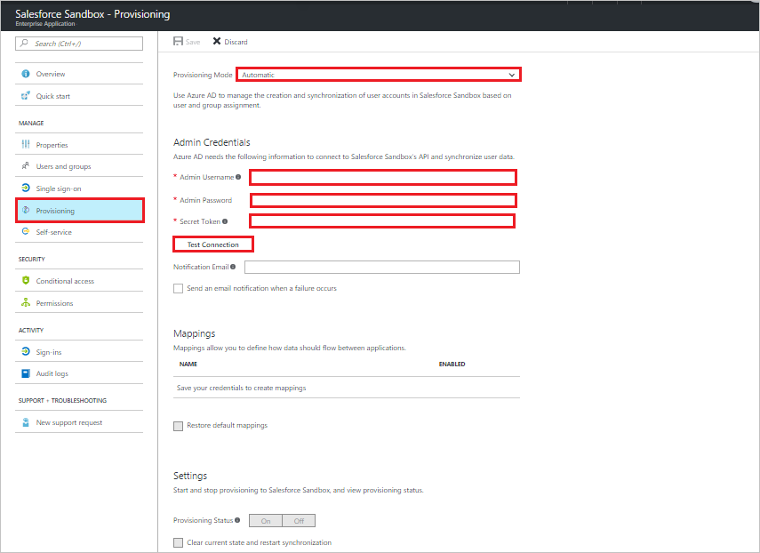
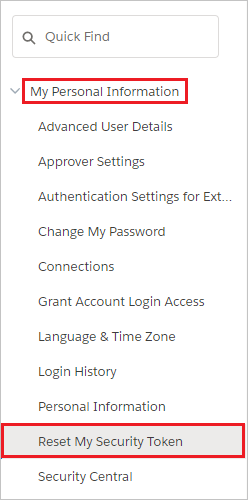

# Tutorial: Configuring Salesforce Sandbox for automatic user provisioning

The objective of this tutorial is to show you the steps you need to perform in Salesforce Sandbox and Azure AD to automatically provision and de-provision user accounts from Azure AD to Salesforce Sandbox.

## Prerequisites

The scenario outlined in this tutorial assumes that you already have the following items:

*   An Azure Active directory tenant.
*   A valid tenant for Salesforce Sandbox for Work or Salesforce Sandbox for Education. You may use a free trial     account for either service.
*   A user account in Salesforce Sandbox with Team Admin permissions.

## Assigning users to Salesforce Sandbox

Azure Active Directory uses a concept called "assignments" to determine which users should receive access to selected apps. In the context of automatic user account provisioning, only the users and groups that have been "assigned" to an application in Azure AD are synchronized.

Before configuring and enabling the provisioning service, you need to decide which users or groups in Azure AD need access to your Salesforce Sandbox app. After you've made this decision, you can assign these users to your Salesforce Sandbox app by following the instructions in [Assign a user or group to an enterprise app](https://docs.microsoft.com/azure/active-directory/active-directory-coreapps-assign-user-azure-portal)

### Important tips for assigning users to Salesforce Sandbox

* It is recommended that a single Azure AD user is assigned to Salesforce Sandbox to test the provisioning configuration. Additional users and/or groups may be assigned later.

* When assigning a user to Salesforce Sandbox, you must select a valid user role. The "Default Access" role does not work for provisioning.

> [!NOTE]
> This app imports custom roles from Salesforce Sandbox as part of the provisioning process, which the customer may want to select when assigning users.

## Enable automated user provisioning

This section guides you through connecting your Azure AD to Salesforce Sandbox's user account provisioning API, and configuring the provisioning service to create, update, and disable assigned user accounts in Salesforce Sandbox based on user and group assignment in Azure AD.

>[!Tip]
>You may also choose to enabled SAML-based Single Sign-On for Salesforce Sandbox, following the instructions provided in [Azure portal](https://portal.azure.com). Single sign-on can be configured independently of automatic provisioning, though these two features compliment each other.

### Configure automatic user account provisioning

The objective of this section is to outline how to enable user provisioning of Active Directory user accounts to Salesforce Sandbox.

1. In the [Azure portal](https://portal.azure.com), browse to the **Azure Active Directory > Enterprise Apps > All applications** section.

2. If you have already configured Salesforce Sandbox for single sign-on, search for your instance of Salesforce Sandbox using the search field. Otherwise, select **Add** and search for **Salesforce Sandbox** in the application gallery. Select Salesforce Sandbox from the search results, and add it to your list of applications.

3. Select your instance of Salesforce Sandbox, then select the **Provisioning** tab.

4. Set the **Provisioning Mode** to **Automatic**.

    

5. Under the **Admin Credentials** section, provide the following configuration settings:
   
    a. In the **Admin Username** textbox, type a Salesforce Sandbox account name that has the **System Administrator** profile in Salesforce.com assigned.
   
    b. In the **Admin Password** textbox, type the password for this account.

6. To get your Salesforce Sandbox security token, open a new tab and sign into the same Salesforce Sandbox admin account. On the top right corner of the page, click your name, and then click **Settings**.

     

7. On the left navigation pane, click **My Personal Information** to expand the related section, and then click **Reset My Security Token**.
  
    

8. On the **Reset Security Token** page, click the **Reset Security Token** button.

    

9. Check the email inbox associated with this admin account. Look for an email from Salesforce Sandbox.com that contains the new security token.

10. Copy the token, go to your Azure AD window, and paste it into the **Secret Token** field.

11. In the Azure portal, click **Test Connection** to ensure Azure AD can connect to your Salesforce Sandbox app.

12. In the **Notification Email** field, enter the email address of a person or group who should receive provisioning error notifications, and check the checkbox.

13. Click **Save.**  
    
14.  Under the Mappings section, select **Synchronize Azure Active Directory Users to Salesforce Sandbox.**

15. In the **Attribute Mappings** section, review the user attributes that are synchronized from Azure AD to Salesforce Sandbox. The attributes selected as **Matching** properties are used to match the user accounts in Salesforce Sandbox for update operations. Select the Save button to commit any changes.

16. To enable the Azure AD provisioning service for Salesforce Sandbox, change the **Provisioning Status** to **On** in the Settings section

17. Click **Save.**

It starts the initial synchronization of any users and/or groups assigned to Salesforce Sandbox in the Users and Groups section. The initial sync takes longer to perform than subsequent syncs, which occur approximately every 20 minutes as long as the service is running. You can use the **Synchronization Details** section to monitor progress and follow links to provisioning activity reports, which describe all actions performed by the provisioning service on Salesforce Sandbox app.

You can now create a test account. Wait for up to 20 minutes to verify that the account has been synchronized to salesforce.

## Additional resources

* [Managing user account provisioning for Enterprise Apps](active-directory-saas-tutorial-list.md)
* [What is application access and single sign-on with Azure Active Directory?](active-directory-appssoaccess-whatis.md)
* [Configure Single Sign-on](https://docs.microsoft.com/azure/active-directory/active-directory-saas-salesforce-sandbox-tutorial)
