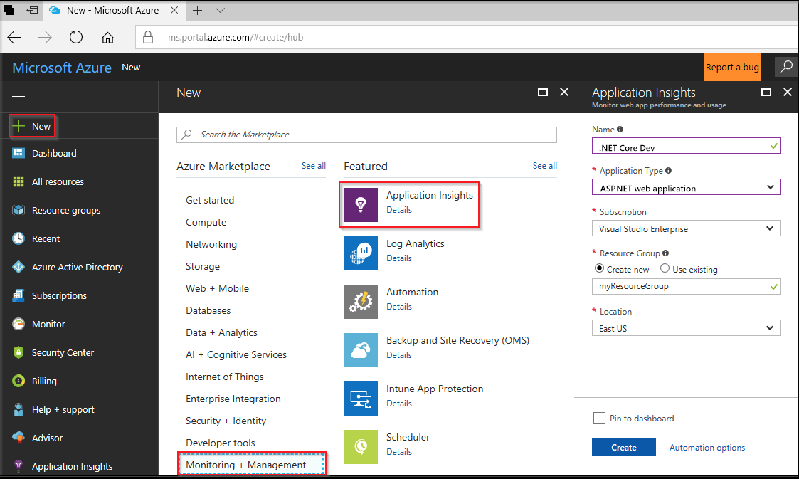
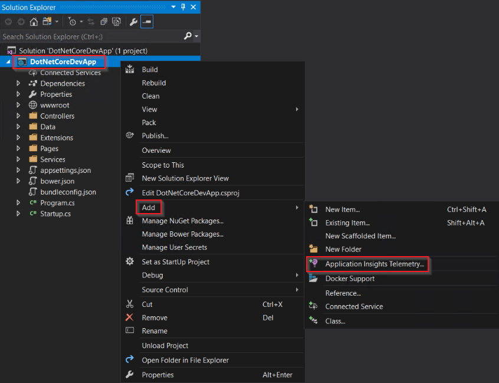
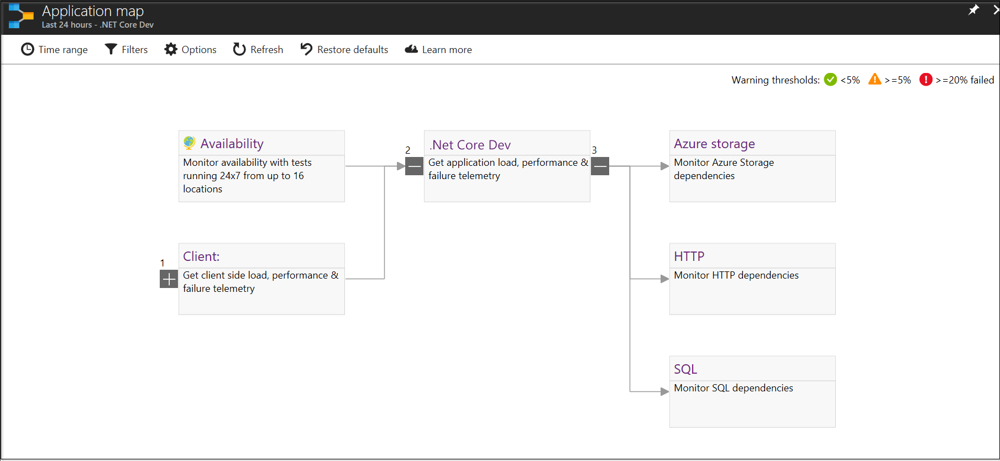
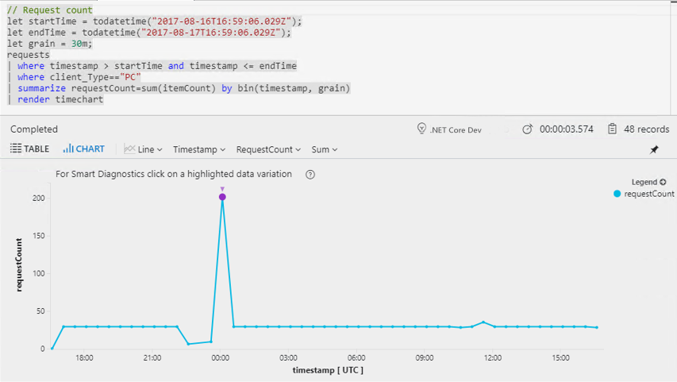
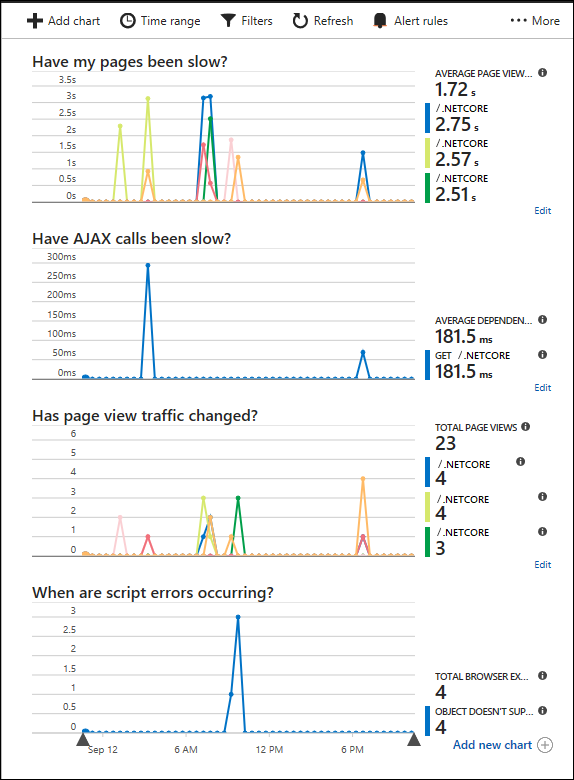

# Start Monitoring Your ASP.NET Core Web Application

With Azure Application Insights, you can easily monitor your web application for availability, performance, and usage. You can also quickly identify and diagnose errors in your application without waiting for a user to report them. 

This quickstart guides you through adding the Application Insights SDK to an existing ASP.Net Core web application. 

## Prerequisites

To complete this quickstart:

- [Install Visual Studio 2017](https://www.visualstudio.com/downloads/) with the following workloads:
  - ASP.NET and web development
  - Azure development
- [Install .NET Core 2.0 SDK](https://www.microsoft.com/net/core)
- You will need an Azure subscription and an existing .NET Core web application.

If you don't have a ASP.NET Core web application, you can create one by following the [Create an ASP.NET Core Web App Guide](https://docs.microsoft.com/aspnet/core/tutorials/publish-to-azure-webapp-using-vs).

If you don't have an Azure subscription, create a [free](https://azure.microsoft.com/free/) account before you begin.

## Log in to the Azure portal

Log in to the [Azure portal](https://portal.azure.com/).

## Enable Application Insights

Application Insights can gather telemetry data from any internet-connected application, regardless of whether it's running on-premises or in the cloud. Use the following steps to start viewing this data.

1. Select **New** > **Monitoring + Management** > **Application Insights**.

   

    A configuration box will appear, use the table below to fill out the input fields.

    | Settings        |  Value           | Description  |
   | ------------- |:-------------|:-----|
   | **Name**      | Globally Unique Value | Name that identifies the app you are monitoring |
   | **Application Type** | ASP.NET web application | Type of app you are monitoring |
   | **Resource Group**     | myResourceGroup      | Name for the new resource group to host App Insights data |
   | **Location** | East US | Choose a location near you, or near where your app is hosted |

2. Click **Create**.

## Configure App Insights SDK

1. Open your ASP.NET Core Web App **project** in Visual Studio > Right-click on the AppName in the **Solution Explorer** > Select **Add** > **Application Insights Telemetry**.

    

2. Click the **Start Free** button > Select the **Existing resource** you created in the Azure portal > Click **Register**.

3. Select **Debug** > **Start without Debugging** (Ctrl+F5) to Launch your app

> [!NOTE]
> It takes 3-5 minutes before data begins appearing in the portal. If this app is a low-traffic test app, keep in mind that most metrics are only captured when there are active requests or operations.

## Start monitoring in the Azure portal

1. You can now reopen the Application Insights **Overview** page in the Azure portal by selecting **Project** > **Application Insights** > **Open Application Insights Portal**, to view details about your currently running application.

   

2. Click **App map** for a visual layout of the dependency relationships between your application components. Each component shows KPIs such as load, performance, failures, and alerts.

   

3. Click on the **App Analytics** icon .  This opens **Application Insights Analytics**, which provides a rich query language for analyzing all data collected by Application Insights. In this case, a query is generated for you that renders the request count as a chart. You can write your own queries to analyze other data.

   

4. Return to the **Overview** page and examine the **Health Overview timeline**.  This dashboard provides statistics about your application health, including the number of incoming requests, the duration of those requests, and any failures that occur. 

   

   To enable the **Page View Load Time** chart to populate with **client-side telemetry** data, add this script to each page that you want to track:

   ```HTML
   <!-- 
   To collect end-user usage analytics about your application, 
   insert the following script into each page you want to track.
   Place this code immediately before the closing </head> tag,
   and before any other scripts. Your first data will appear 
   automatically in just a few seconds.
   -->
   <script type="text/javascript">
     var appInsights=window.appInsights||function(config){
       function i(config){t[config]=function(){var i=arguments;t.queue.push(function(){t[config].apply(t,i)})}}var t={config:config},u=document,e=window,o="script",s="AuthenticatedUserContext",h="start",c="stop",l="Track",a=l+"Event",v=l+"Page",y=u.createElement(o),r,f;y.src=config.url||"https://az416426.vo.msecnd.net/scripts/a/ai.0.js";u.getElementsByTagName(o)[0].parentNode.appendChild(y);try{t.cookie=u.cookie}catch(p){}for(t.queue=[],t.version="1.0",r=["Event","Exception","Metric","PageView","Trace","Dependency"];r.length;)i("track"+r.pop());return i("set"+s),i("clear"+s),i(h+a),i(c+a),i(h+v),i(c+v),i("flush"),config.disableExceptionTracking||(r="onerror",i("_"+r),f=e[r],e[r]=function(config,i,u,e,o){var s=f&&f(config,i,u,e,o);return s!==!0&&t["_"+r](config,i,u,e,o),s}),t
       }({
           instrumentationKey:"<insert instrumentation key>"
       });
       
       window.appInsights=appInsights;
       appInsights.trackPageView();
   </script>
   ```

5. Click on **Browser** from under the **Investigate** header. Here you find metrics related to the performance of your app's pages . You can click **Add new chart** to create additional custom views or select **Edit** to modify the existing chart types, height, color palette, groupings, and metrics.

   

## Clean up resources

If you plan to continue on to work with subsequent quickstarts or with the tutorials, do not clean up the resources created in this quick start. If you do not plan to continue, use the following steps to delete all resources created by this quick start in the Azure portal.

1. From the left-hand menu in the Azure portal, click **Resource groups** and then click **myResourceGroup**.
2. On your resource group page, click **Delete**, type **myResourceGroup** in the text box, and then click **Delete**.

## Next steps

> [!div class="nextstepaction"]
> [Find and diagnose run-time exceptions](https://docs.microsoft.com/azure/application-insights/app-insights-tutorial-runtime-exceptions)
