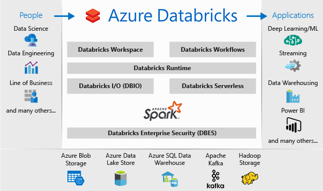
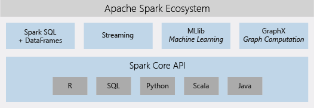

# What is Azure Databricks?

Azure Databricks is an Apache Spark-based analytics platform optimized for the Microsoft Azure cloud services platform. Designed with the founders of Apache Spark, Databricks is integrated with Azure to provide one-click setup, streamlined workflows, and an interactive workspace that enables collaboration between data scientists, data engineers, and business analysts.

## Apache Spark-based analytics platform

Azure Databricks comprises the complete open-source Apache Spark cluster technologies and capabilities. Spark in Azure Databricks includes the following components:

* **Spark SQL and DataFrames**: Spark SQL is the Spark module for working with structured data. A DataFrame is a distributed collection of data organized into named columns. It is conceptually equivalent to a table in a relational database or a data frame in R/Python.

* **Streaming**: Real-time data processing and analysis for analytical and interactive applications. Integrates with HDFS, Flume, and Kafka.

* **MLib**: Machine Learning library consisting of common learning algorithms and utilities, including classification, regression, clustering, collaborative filtering, dimensionality reduction, as well as underlying optimization primitives.

* **GraphX**: Graphs and graph computation for a broad scope of use cases from cognitive analytics to data exploration.

* **Spark Core API**: Includes support for R, SQL, Python, Scala, and Java.

## Apache Spark in Azure Databricks

Azure Databricks builds on the capabilities of Spark by providing a zero-management cloud platform that includes:

- Fully managed Spark clusters
- An interactive workspace for exploration and visualization
- A platform for powering your favorite Spark-based applications

### Fully managed Apache Spark clusters in the cloud

Azure Databricks has a secure and reliable production environment in the cloud, managed and supported by Spark experts. You can:

* Create clusters in seconds.
* Dynamically autoscale clusters up and down, including serverless clusters, and share them across teams. 
* Use clusters programmatically by using the REST APIs. 
* Use secure data integration capabilities built on top of Spark that enable you to unify your data without centralization. 
* Get instant access to the latest Apache Spark features with each release.

### Databricks Runtime
The Databricks Runtime is built on top of Apache Spark and is natively built for the Azure cloud. 

With the **Serverless** option, Azure Databricks completely abstracts out the infrastructure complexity and the need for specialized expertise to set up and configure your data infrastructure. The Serverless option helps data scientists iterate quickly as a team.

For data engineers, who care about the performance of production jobs, Azure Databricks provides a Spark engine that is faster and performant through various optimizations at the I/O layer and processing layer (Databricks I/O).

### Workspace for collaboration

Through a collaborative and integrated environment, Azure Databricks streamlines the process of exploring data, prototyping, and running data-driven applications in Spark.

* Determine how to use data with easy data exploration.
* Document your progress in notebooks in R, Python, Scala, or SQL.
* Visualize data in a few clicks, and use familiar tools like Matplotlib, ggoplot, or d3.
* Use interactive dashboards to create dynamic reports.
* Use Spark and interact with the data simultaneously.

## Enterprise security

Azure Databricks provides enterprise-grade Azure security, including Azure Active Directory integration, role-based controls, and SLAs that protect your data and your business.

* Integration with Azure Active Directory enables you to run complete Azure-based solutions using Azure Databricks.
* Azure Databricks roles-based access enables fine-grained user permissions for notebooks, clusters, jobs, and data.
* Enterprise-grade SLAs. 

## Integration with Azure services

Azure Databricks integrates deeply with Azure databases and stores: SQL Data Warehouse, Cosmos DB, Data Lake Store, and Blob Storage. 

## Integration with Power BI
Through rich integration with Power BI, Azure Databricks allows you to discover and share your impactful insights quickly and easily. You can use other BI tools as well, such as Tableau Software via JDBC/ODBC cluster endpoints.

## Next steps

* [Quickstart: Run a Spark job on Azure Databricks](quickstart-create-databricks-workspace-portal.md)
* [Work with Spark clusters](https://docs.azuredatabricks.net/user-guide/clusters/index.html)
* [Work with notebooks](https://docs.azuredatabricks.net/user-guide/notebooks/index.html)
* [Create Spark jobs](https://docs.azuredatabricks.net/user-guide/jobs.html)

 

