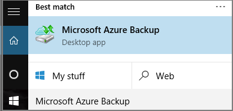
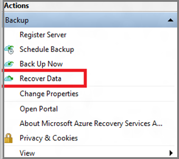
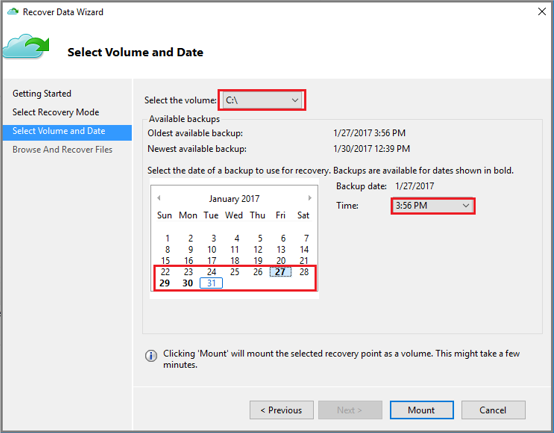
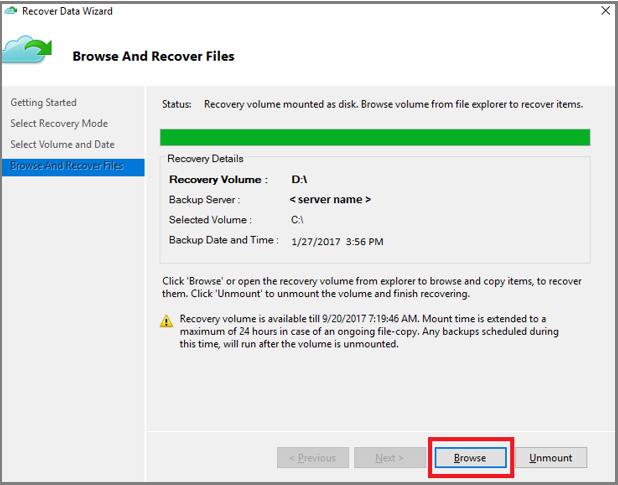
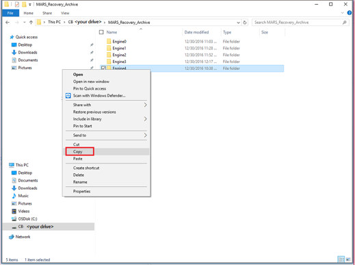
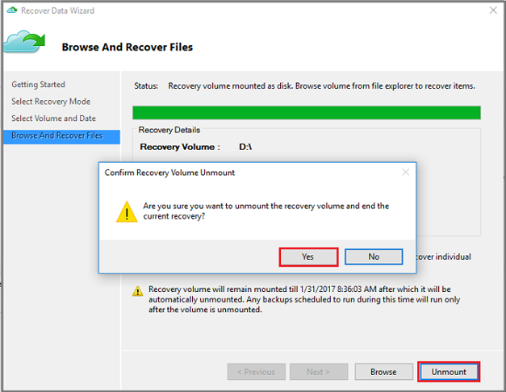

# Recover files from Azure to a Windows Server

Azure Backup enables the recovery of individual items from backups of your Windows Server. Recovering individual files is helpful if you must quickly restore files that are accidentally deleted. This tutorial covers how you can use the Microsoft Azure Recovery Services Agent (MARS) agent to recover items from backups you have already performed in Azure. In this tutorial you learn how to:

> [!div class="checklist"]
> * Initiate recovery of individual items 
> * Select a recovery point 
> * Restore items from a recovery point

This tutorial assumes you have already performed the steps to [Back up a Windows Server to Azure](backup-configure-vault.md) and have at least one backup of your Windows Server files in Azure.

## Initiate recovery of individual items

A helpful user interface wizard named Microsoft Azure Backup is installed with the Microsoft Azure Recovery Services (MARS) agent. The Microsoft Azure Backup wizard works with the Microsoft Azure Recovery Services (MARS) agent to retrieve backup data from recovery points stored in Azure. Use the Microsoft Azure Backup wizard to identify the files or folders you want to restore to Windows Server. 

1. Open the **Microsoft Azure Backup** snap-in. You can find it by searching your machine for **Microsoft Azure Backup**.

    

2. In the wizard, click **Recover Data** in the **Actions Pane** of the agent console to start the **Recover Data** wizard.

    

3. On the **Getting Started** page, select **This server (server name)** and click **Next**.

4. On the **Select Recovery Mode** page, select **Individual files and folders** and then click **Next** to begin the recovery point selection process.
 
5. On the **Select Volume and Date** page, select the volume that contains the files or folders you want to restore, and click **Mount**. Select a date, and select a time from the drop-down menu that corresponds to a recovery point. Dates in **bold** indicate the availability of at least one recovery point on that day.

    
 
    When you click **Mount**, Azure Backup makes the recovery point available as a disk. Browse and recover files from the disk.

## Restore items from a recovery point

1. Once the recovery volume is mounted, click **Browse** to open Windows Explorer and find the files and folders you wish to recover. 

    

    You can open the files directly from the recovery volume and verify the files.

2. In Windows Explorer, copy the files and/or folders you want to restore and paste them to any desired location on the server.

    

3. When you are finished restoring the files and/or folders, on the **Browse and Recovery Files** page of the **Recover Data** wizard, click **Unmount**. 

    

4.	Click **Yes** to confirm that you want to unmount the volume.

    Once the snapshot is unmounted, **Job Completed** appears in the **Jobs** pane in the agent console.

## Next steps

This completes the tutorials on backing up and restoring Windows Server data to Azure. To learn more about Azure Backup, see the PowerShell sample for backing up encrypted virtual machines.

> [!div class="nextstepaction"]
> [Back up encrypted VM](./scripts/backup-powershell-sample-backup-encrypted-vm.md)
