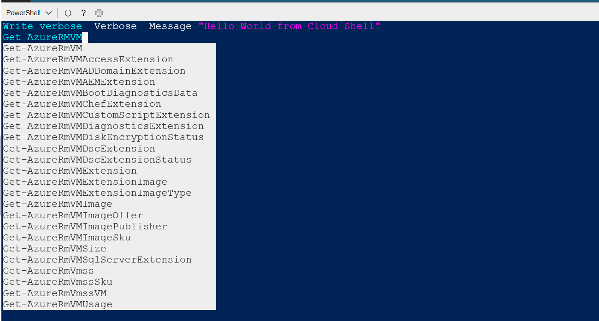
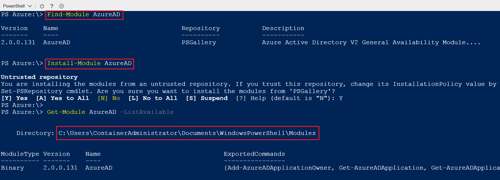

# Features & tools for PowerShell in Azure Cloud Shell (Preview)

[!include [features-introblock](../../includes/cloud-shell-features-introblock.md)]

> [!TIP]
> Features & tools for [Bash](features.md) is also available.

PowerShell in Cloud Shell (Preview) runs on `Windows Server 2016`.

## Features

### Secure automatic authentication

PowerShell in Cloud Shell (Preview) securely and automatically authenticates account access for the Azure PowerShell.

### Files persistence across sessions

To persist files across sessions, Cloud Shell walks you through attaching a Microsoft Azure Files share on first launch.
Once completed, Cloud Shell will automatically attach your storage (mounted as `$home\clouddrive`) for all future sessions.
Since each request for Cloud Shell is allocating a temporary machine, files outside of your `$home\clouddrive` and machine state are not persisted across sessions.

[Learn more about attaching Azure file shares to Cloud Shell.](persisting-shell-storage-powershell.md)

### Azure drive (Azure:)

PowerShell in Cloud Shell (Preview) starts you in Azure drive (`Azure:`).
Azure drive enables easy discovery and navigation of Azure resources such as Compute, Network, Storage etc. similar to filesystem navigation.
You can continue to use the familiar [Azure PowerShell cmdlets](https://docs.microsoft.com/powershell/azure) to manage these resources.
Any changes made to the Azure resources, either made directly in Azure portal or through Azure PowerShell cmdlets, are instantly reflected in the Azure drive.

#### Contextual awareness

- **Resource group scoping**: When within the context of a resource group path in the Azure drive (`Azure:`), the resource group name is automatically passed to the Azure PowerShell cmdlets.

    

- **Get-AzureRmCommand**: This cmdlet returns the list of commands applicable in the context of the location under Azure drive (`Azure:`). For example, it shows only storage-related commands when user is under `Azure:\<subscription name>\StorageAccounts`

    

### Rich PowerShell script editing

When you use VIM to edit PowerShell files (`.ps1,.psm1,.psd1`), you automatically get syntax highlighting and IntelliSense support.
IntelliSense support is implemented via a vim-plugin that interacts with a local instance of [PowerShell Editor Services](https://github.com/PowerShell/PowerShellEditorServices).

> [!TIP]
> Use `TAB` to get completion (IntelliSense) on command names, parameter names, and parameter values (where applicable).

### Extensible model

Using [PowerShellGet](https://docs.microsoft.com/powershell/module/powershellget), you can easily install (and update) custom modules and scripts from the [PowerShell Gallery](https://www.powershellgallery.com).
After installation, your modules are automatically persisted across Cloud Shell sessions.

> [!TIP]
> Modules installed by users are saved in the `$Home\CloudDrive\.pscloudshell\WindowsPowerShell` folder. A symbolic link for this folder is created in the user's documents folder (`$home\Documents\WindowsPowerShell`).

### Management of Guest VMs

Using two built-in commands - `Enter-AzureRmVM` and `Invoke-AzureRmVMCommand`, you can remotely manage your Azure VMs.
These commands are built on top of PowerShell remoting and require PowerShell connectivity to the Azure VMs.

## Tools

|**Category**    |**Name**                                 |
|----------------|-----------------------------------------|
|Azure tools     |[Azure PowerShell (5.0.1)](https://docs.microsoft.com/powershell/azure/overview?view=azurermps-5.0.0)  [Azure CLI (2.0.22)](https://docs.microsoft.com/cli/azure/overview)|
|Text editors    |vim  nano                             |
|Package Manager |PowerShellGet  PackageManagement  npm  pip |
|Source control  |git                                      |
|Databases       |[SqlServer module](https://www.powershellgallery.com/packages/SqlServer)  [sqlcmd Utility](https://docs.microsoft.com/sql/tools/sqlcmd-utility)      |
|Test tools      |Pester                                   |

## Language support

|**Language**|**Version**|
|------------|-----------|
|.NET        |4.6        |
|Node.js     |6.10       |
|PowerShell  |5.1 and [6.0 (beta)](https://github.com/PowerShell/powershell/releases)       |
|Python      |2.7        |

## Next steps

[Quickstart with PowerShell in Cloud Shell (Preview)](quickstart-powershell.md)

[Learn about Azure PowerShell](https://docs.microsoft.com/powershell/azure/)
