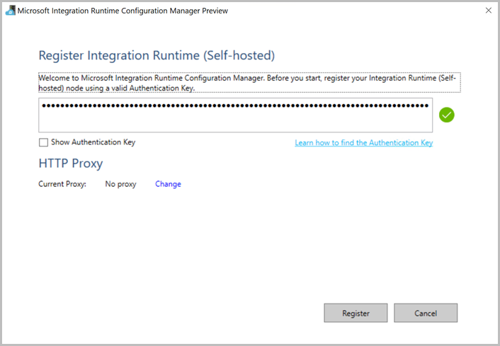
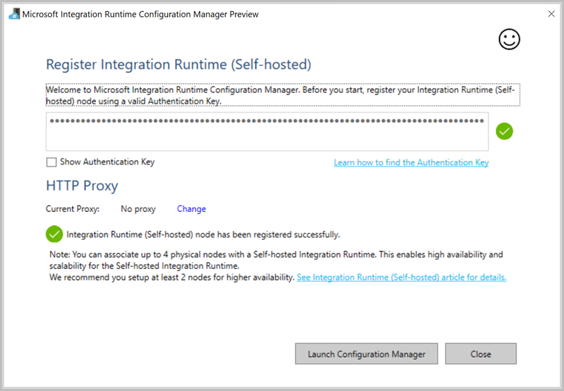
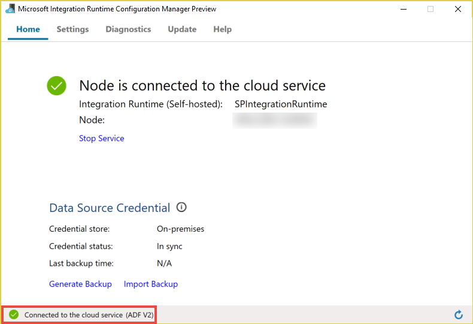

## Create a self-hosted IR

In this section, you create a self-hosted integration runtime, and associate it with an on-premises machine with the SQL Server database. The self-hosted integration runtime is the component that copies data from SQL Server on your machine to the Azure blob storage. 

1. Create a variable for the name of integration runtime. Use a unique name, and note down the name. You use it later in this tutorial. 

    ```powershell
   $integrationRuntimeName = "ADFTutorialIR"
    ```
1. Create a self-hosted integration runtime. 

   ```powershell
   Set-AzureRmDataFactoryV2IntegrationRuntime -Name $integrationRuntimeName -Type SelfHosted -DataFactoryName $dataFactoryName -ResourceGroupName $resourceGroupName
   ```

   Here is the sample output:

   ```json
    Id                : /subscriptions/<subscription ID>/resourceGroups/ADFTutorialResourceGroup/providers/Microsoft.DataFactory/factories/onpremdf0914/integrationruntimes/myonpremirsp0914
    Type              : SelfHosted
    ResourceGroupName : ADFTutorialResourceGroup
    DataFactoryName   : onpremdf0914
    Name              : myonpremirsp0914
    Description       :
    ```
 ​

2. Run the following command to retrieve status of the created integration runtime. Confirm that the value of the **State** property is set to **NeedRegistration**. 

   ```powershell
   Get-AzureRmDataFactoryV2IntegrationRuntime -name $integrationRuntimeName -ResourceGroupName $resourceGroupName -DataFactoryName $dataFactoryName -Status
   ```

   Here is the sample output:

   ```json
   Nodes                     : {}
   CreateTime                : 9/14/2017 10:01:21 AM
   InternalChannelEncryption :
   Version                   :
   Capabilities              : {}
   ScheduledUpdateDate       :
   UpdateDelayOffset         :
   LocalTimeZoneOffset       :
   AutoUpdate                :
   ServiceUrls               : {eu.frontend.clouddatahub.net, *.servicebus.windows.net}
   ResourceGroupName         : <ResourceGroup name>
   DataFactoryName           : <DataFactory name>
   Name                      : <Integration Runtime name>
   State                     : NeedRegistration
   ```

3. Run the following command to retrieve **authentication keys** to register the self-hosted integration runtime with Data Factory service in the cloud. 

   ```powershell
   Get-AzureRmDataFactoryV2IntegrationRuntimeKey -Name $integrationRuntimeName -DataFactoryName $dataFactoryName -ResourceGroupName $resourceGroupName | ConvertTo-Json
   ```

   Here is the sample output:

   ```json
   {
       "AuthKey1":  "IR@0000000000-0000-0000-0000-000000000000@xy0@xy@xxxxxxxxxxxxxxxxxxxxxxxxxxxxxxxxxxxxxxxx=",
       "AuthKey2":  "IR@0000000000-0000-0000-0000-000000000000@xy0@xy@yyyyyyyyyyyyyyyyyyyyyyyyyyyyyyyyyyyyyyyy="
   }
   ```    
4. Copy one of the keys (exclude double quotes) for registering the self-hosted integration runtime that you install on your machine in the next step.  

## Install integration runtime
1. If you already have the **Microsoft Integration Runtime** on your machine, uninstall it by using **Add or Remove Programs**. 
2. [Download](https://www.microsoft.com/download/details.aspx?id=39717) the self-hosted integration runtime on a local windows machine, and run the installation. 
3. On the **Welcome to Microsoft Integration Runtime Setup Wizard**, click **Next**.  
4. On the **End-User License Agreement** page, accept the terms and license agreement, and click **Next**. 
5. On the **Destination Folder** page, click **Next**. 
6. On the **Ready to install Microsoft Integration Runtime**, click **Install**. 
7. If you see a warning message about the computer being configured to enter sleep or hibernate mode when not in use, click **OK**. 
8. If you see the **Power Options** window, close it, and switch to the setup window. 
9. On the **Completed the Microsoft Integration Runtime Setup Wizard** page, click **Finish**.
10. On the **Register Integration Runtime (Self-hosted)** page, paste the key you saved in the previous section, and click **Register**. 

   
2. You see the following message when the self-hosted integration runtime is registered successfully:

   

3. On the **New Integration Runtime (Self-hosted) Node** page, click **Next**. 

    
4. On the **Intranet Communication Channel**, click **Skip**. You can select a TLS/SSL certification for securing intra-node communication in a multi-node integration runtime environment. 

    
5. On the **Register Integration Runtime (Self-hosted)** page, click **Launch Configuration Manager**. 
6. You see the following page when the node is connected to the cloud service:

   
7. Now, test the connectivity to your SQL Server database.

       

    - In the **Configuration Manager** window, Switch to the **Diagnostics** tab.
    - Select **SqlServer** for **Data source type**.
    - Enter the **server** name.
    - Enter the **database** name. 
    - Select the **authentication** mode. 
    - Enter **user** name. 
    - Enter **password** for the user name.
    - Click **Test** to confirm that integration runtime can connect to the SQL Server. You see a green check mark if the connection is successful. Otherwise, you see an error message associated with the failure. Fix any issues and ensure that the integration runtime can connect to your SQL Server.    

    > [!NOTE]
    > Note down these values (authentication type, server, database, user, password). You use them later in this tutorial. 
    
