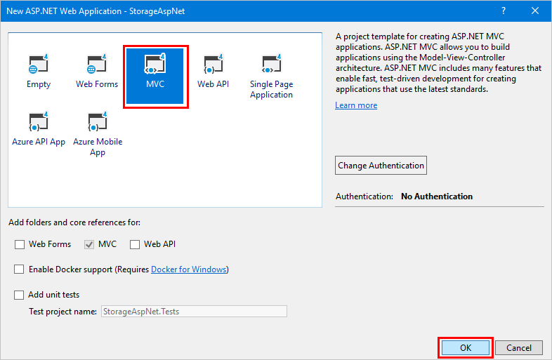
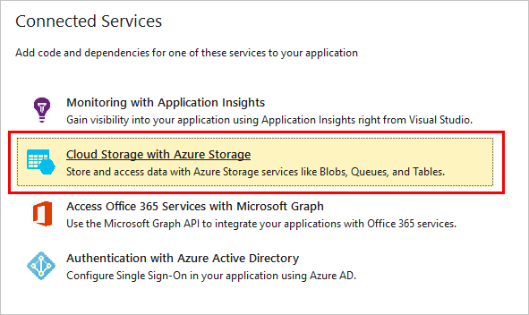

## Set up the development environment

This section walks through setting up the development environment, including creating an ASP.NET MVC app, adding a Connected Services connection, adding a controller, and specifying the required namespace directives.

### Create an ASP.NET MVC app project

1. Open Visual Studio.

1. Select **File->New->Project** from the main menu

1. On the **New Project** dialog, specify the options as highlighted in the following figure:

	

1. Select **OK**.

1. On the **New ASP.NET Project** dialog, specify the options as highlighted in the following figure:

	

1. Select **OK**.

### Use Connected Services to connect to an Azure storage account

1. In the **Solution Explorer**, right-click the project, and from the context menu, select **Add->Connected Service**.

1. On the **Add Connected Service** dialog, select **Cloud Storage with Azure Storage**, and then select **Configure**.

	

1. On the **Azure Storage** dialog, select the Azure Storage account to be used for this tutorial.  To create a new Azure Storage account, click **Create a New Storage Account** and complete the form.  After selecting either an existing storage account or creating a new one, click **Add**.  Visual Studio will install the NuGet package for Azure Storage and a storage connection string to **Web.config**.

> [!TIP]
> To learn how to create a storage account with the [Azure portal](https://portal.azure.com), see [Create a storage account](../articles/storage/common/storage-create-storage-account.md#create-a-storage-account).
>
> An Azure storage account can also be created using [Azure PowerShell](../articles/storage/common/storage-powershell-guide-full.md), [Azure CLI](../articles/storage/common/storage-azure-cli.md), or the [Azure Cloud Shell](../articles/cloud-shell/overview.md).

